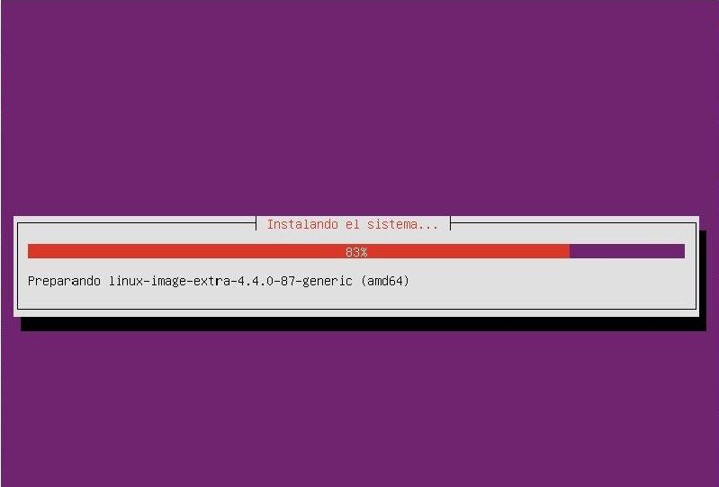
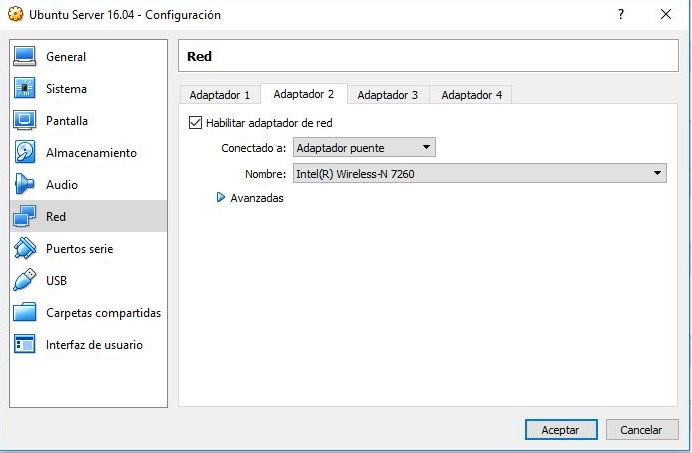

## Miniproyecto Sistemas Operativos

**Universidad ICESI**  
**Curso:** Sistemas Operativos  
**Docente:** Daniel Barragán C.  
**Tema:**  Servicios web  
**Correo:** daniel.barragan at correo.icesi.edu.co

**Estudiante:** Daniel Steven Ocampo  
**Código:** A00053980  
**Correo:** danielsteven23@hotmail.com ó daniel.ocampo2@correo.icesi.edu.co

## Objetivos
* Desplegar una aplicación en un servidor que ejecuta el sistema operativo Linux
* Realizar los ajustes y depuración necesarios para desplegar una
aplicación en Linux
* Realizar aplicaciones para obtener información del sistema operativo

## Descripción
Para el despliegue de una aplicación en un servidor se requiere conocer los procedimientos necesarios relacionados con la configuracion de las interfaces de red, ajustes de seguridad, instalación de dependencias, usuarios y herramientas de depuracíon del sistema operativo.

El siguiente proyecto consiste en el despliegue de una aplicación web para obtener información del sistema operativo (La aplicación debe permitir consulta uso de CPU, memoria y espacio en disco). Para este propósito se debe emplear el sistema operativo Ubuntu Server 16.04, el microframework flask y ambientes virtuales.

  

## Actividades
* Nombre y código de todos los integrantes del grupo (máximo 3) (5%)
* Ortografía y redacción (5%)
* Descripción breve de los pasos para cumplir con lo solicitado
  * Sistema operativo Ubuntu Server 16.04 (10%)
  * Configuración de interfaces de red (10%)
  * Configuración de puertos (10%)
  * Instalación de dependencias (10%)
  * Creación de ambientes virtuales (10%)
  * Aplicación en Python (10%)
  * Validación de la ejecución del servicio (netstat) (10%)
* Pruebas de la solución a través de capturas de pantalla. Puede emplear si lo desea una herramienta de captura de pantalla a formato .gif (10%)
* El informe debe ser entregado en formato pdf a través del moodle y el informe en formato README.md debe ser subido a un repositorio de github. El repositorio de github debe ser un fork de https://github.com/ICESI-Training/so-project y para la entrega deberá hacer un Pull Request (PR) respetando la estructura definida. El código fuente y la url de github deben incluirse en el informe (10%).

## Referencias
* https://www.ubuntu.com/download/server

## Solución

## * Instalación Sistema operativo Ubuntu Server 16.04  n 

Para la instalación del sistema operativo se descargó la imagen (.iso) del ubuntu server, posterior a esto se realizó la instalación de la maquina virtual en Virtual Box como lo muestra en la imagen.

  

## * Configuración de interfaces de red  

En las configuraciones de la maquina virtual dentro del virtual box, configuramos dos adaptadores, un adaptador NAT y un Adatador puente (enp0s8) como lo muestra en la siguiente imagen

  

