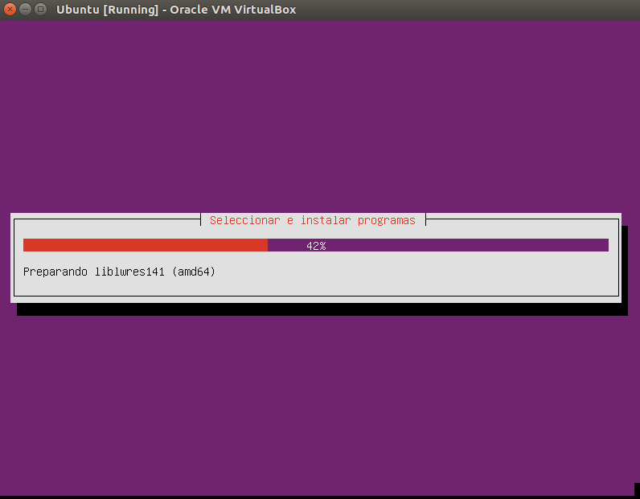
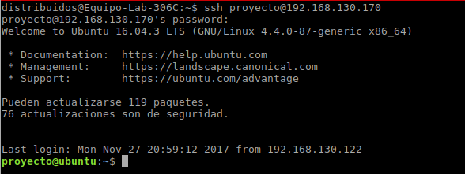
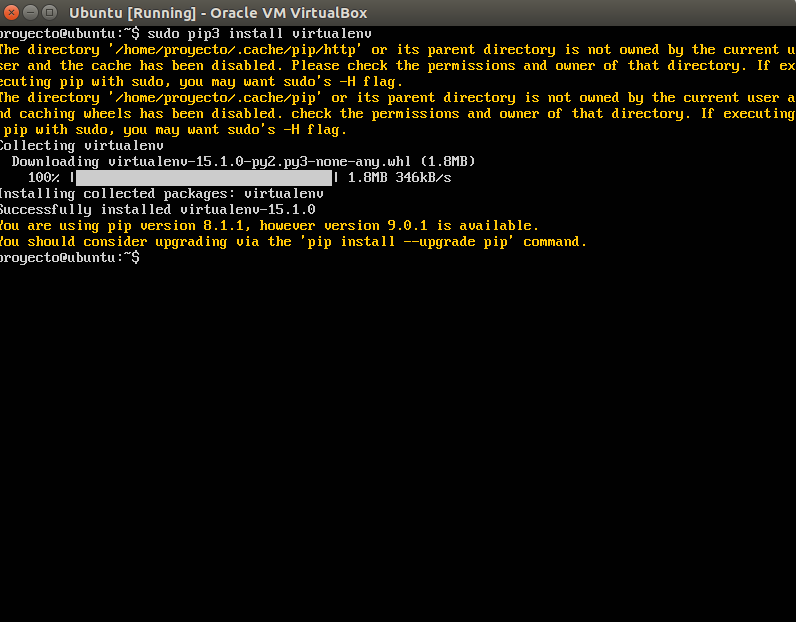
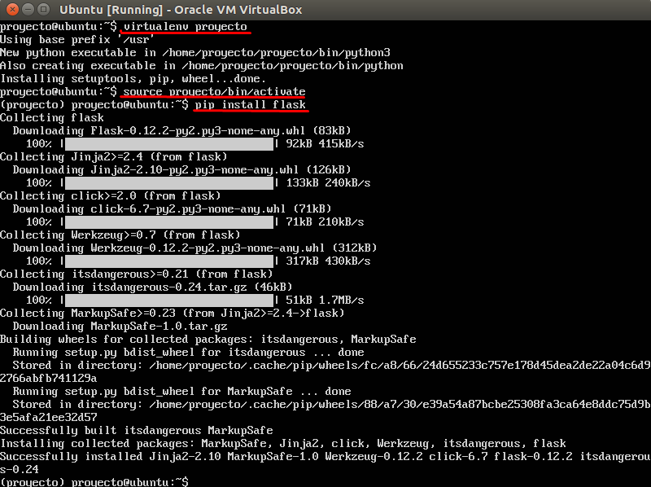
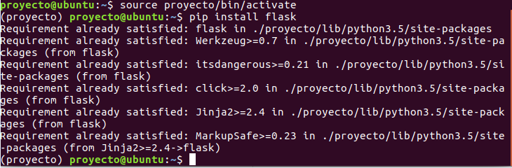

## Miniproyecto Sistemas Operativos

**Universidad ICESI**  

**Nombres:**
  * Esteban Camacho B. - A00320168  
  * Oscar Daniel Molano. - A00267576 
  * Jhon Eduar Tobar G. - A00316212
  
**Github URL:** https://github.com/LookIron/so-project

**Curso:** Sistemas Operativos  
**Docente:** Daniel Barragán C.  
**Tema:**  Servicios web  
**Correo:** daniel.barragan at correo.icesi.edu.co

## Objetivos
* Desplegar una aplicación en un servidor que ejecuta el sistema operativo Linux
* Realizar los ajustes y depuración necesarios para desplegar una
aplicación en Linux
* Realizar aplicaciones para obtener información del sistema operativo

## Descripción
Para el despliegue de una aplicación en un servidor se requiere conocer los procedimientos necesarios relacionados con la configuracion de las interfaces de red, ajustes de seguridad, instalación de dependencias, usuarios y herramientas de depuracíon del sistema operativo.

El siguiente proyecto consiste en el despliegue de una aplicación web para obtener información del sistema operativo (La aplicación debe permitir consulta uso de CPU, memoria y espacio en disco). Para este propósito se debe emplear el sistema operativo Ubuntu Server 16.04, el microframework flask y ambientes virtuales.

<p align="center">
  
</p>

## Actividades
* Nombre y código de todos los integrantes del grupo (máximo 3) (5%)
* Ortografía y redacción (5%)
* Descripción breve de los pasos para cumplir con lo solicitado
  * Sistema operativo Ubuntu Server 16.04 (10%)
  * Configuración de interfaces de red (10%)
  * Configuración de puertos (10%)
  * Instalación de dependencias (10%)
  * Creación de ambientes virtuales (10%)
  * Aplicación en Python (10%)
  * Validación de la ejecución del servicio (netstat) (10%)
* Pruebas de la solución a través de capturas de pantalla. Puede emplear si lo desea una herramienta de captura de pantalla a formato .gif (10%)
* El informe debe ser entregado en formato pdf a través del moodle y el informe en formato README.md debe ser subido a un repositorio de github. El repositorio de github debe ser un fork de https://github.com/ICESI-Training/so-project y para la entrega deberá hacer un Pull Request (PR) respetando la estructura definida. El código fuente y la url de github deben incluirse en el informe (10%).

----------------

## Solución

Para la realización del proyecto seguimos los siguientes pasos:

#### *1. Intalación de Ubuntu 16.04:* Se descargó la ISO de `Ubuntu Server` y se realizó la instalacción utilizando VirtualBox como se muestra a continuación:

  * ###### _Configuración de la maquina virtual:_
  
     <p align="center">
     
     </p>
     
  * ###### _Instalacción de `Ubuntu Server 16.04`_
  
     <p align="center">
     
     </p>
     
     <p align="center">
     
     </p>
    
  * Posterior a esto se creó un usuario proyecto para la realización de los demás pasos.
  
     ```vim
     # adduser proyecto
     # pwdpass ********
     
     ```
 
--------------------------

#### *2. Configuración de la interfaces de red:* Ésta se realizó a través de la interfaz de VirtualBox en dos modos uno `NAT` que nos permite traducir las IPs privadas de la red en una IP pública para que la red pueda enviar paquetes al exterior; y traducir luego esa IP pública, de nuevo a la IP privada del pc que envió el paquete, para que pueda recibirlo una vez que llega la respuesta. Y un modo `Adaptador puente (Bridge)` el cual nos permite conectar dos segmentos de red iguales o distintos para que así a traves de otro nodo se pueda acceder al servicio de wed del nodo en el que se pondra el servicio web a través de flask. A continuación mostramos como se realizó dicho proceso.

  * Configuración de la red
  
     <p align="center">
     
     </p>
     
     <p align="center">
     
     </p>
    
  * Verificación del archivo interfaces: Debido a que nuestra red cuenta con `dhcp` la ip se genera dinamicamente por la tanto NO vamos a fijar nuestra interfaces para que sea estatica y quede permanente sino que el archivo la dejaremos así, y a través del comando en el siguiente ítem habilitaremos la ip de la interfaces manual. A continuación mostramos el archivo de configuración.
  
    ###### _Accedemos al archivo interfaces_
     
     ```python
      # vim /etc/network/interfaces
      
     ```
     
    ###### _Configuramos el archivo_
     
     ```python
      # This file describes the network interfaces available on your system
      # and how to activate them. For more information, see interfaces(5).
      
      source /etc/network/interfaces.d/*
      
      # The loopback network interface
      auto lo
      iface lo inet loopback
      
      # The primary network interface
      auto enp0s3
      iface enp0s3 inet dhcp
      
      # The secondary network interface
      auto enp0s8
      iface enp0s8 inet manual
     
     ```
     
  * Luego de lo anterior y reiniciar la red realizamos lo siguiente para poner la ip de la interfaces, luego habilitamos la ip del gateway y luego reiniciamos la red.
  
    
     ```vim
      # ip addr add 192.168.130.170/24 dev enp0s8
      # route add default gw 192.168.130.1
      # service networking restart
     ```
  
  * Vale aclarar que los comandos se realizaron por conexión ssh como se muestra a continuación, el primer comando lo ejecutamos desde la maquina virtual, y la conexión la realizamos desde el nodo host.
  
  
    ###### _Instalación de Openssh_
     
     ```vim
      # apt-get install openssh
     ```
    ###### _Verificamos el funcionamiento_
    
     <p align="center">
     
     </p>
      

#### *3. Configuración de puertos:* Una vez configurada la interfaces de red, proseguimos a congigurar los puertos, para esto se realizaron los siguientes pasos:

  * Se habilito el firewall a través de la herramienta `ufw` con el siguiente comando
  
     ```vim
      # ufw enable

     ```
     
  * Se habilito el puerto 8080 para los servicios que se van a prestar, con el siguiente comando
  
     ```vim
      # ufw allow 8080

     ```
  
  * Por último verificamos que efectivamente estan habilitado, con el siguiente comando.
  
     ```vim
      # ufw status verbose

     ```
  * Prueba de funcionamiento
  
     <p align="center">
     
     </p>
  

#### *4. Instalación de las dependencias:* Debemos realizar esto para la configuración del ambiente virtual. Para esto realizamos los siguientes pasos:

  * Debemos de verificar la versión de python la cual en `Ubuntu Server 16.04` viene por defecto la 3, una vez realizado esto se instalaron las siguientes dependencias:
  
    ###### _Instalacion de pip y virtualenv_
     
     ```vim
      # sudo apt-get install python3-pip
      # sudo pip3 install virtualenv     

     ```     
    ###### _Instalación_
    
     <p align="center">
     
     </p>
     
  * Una vez descargado las dependencias para el ambiente de virtualización creamos el ambiente `proyecto` 
  
     ```vim
      # virtualenv proyecto
    
     ```
  * Proseguimos a activar el ambiente
  
     ```vim
      # source proyecto/bin/activate
    
     ```
       
  * Ahora dentro del ambiente instalamos `flask`
  
    ###### _Instalación_
    
     <p align="center">
     
     </p>
     
    ###### _Verificación_
     <p align="center">
     
     </p>
  

#### *5. Aplicación en Python:* Para este paso creamos la un script el cual tendrá los servicios requeridos dentro del proyecto como la consulta del uso de cpu, espacio en disco, la memoria y el netstat.

  * Dentro del entorno virtual creamos el siguiente script  `services.py`
  
      ```python
      from flask import Flask
      import os
      app = Flask(__name__)
      
      @app.route("/memoria")
      def memory():
        m=os.system("echo | free > /home/proyecto/memory_Info.txt")
        f=open("/home/proyecto/memory_Info.txt","r")
        return f.read()
      
      @app.route("/cpu")
      def cpu():
        m=os.system("echo | lscpu > /home/proyecto/cpu_Info.txt")
        f=open("/home/proyecto/cpu_Info.txt","r")
        return f.read()
      
      @app.route("/disco")
      def disk():
        m=os.system("echo | df > /home/proyecto/disco_Info.txt")
        f=open("/home/proyecto/disco_Info.txt","r")
        return f.read()
        
      @app.route("/netstat")
      def netstat():
        m=os.system("echo | netstat > /home/proyecto/netstat_Info.txt")
        f=open("/home/proyecto/netstat_Info.txt","r")
        return f.read()
      if __name__=="__main__":
        app.run('0.0.0.0',port=8080)
      
      ```
  
  * Ya creado el script lo ejecutamos dentro del ambiente virtual ya creado y activado, a continuación se muestra como se activa y se ejecuta el script con los servicios y como desde otro nodo se acceden a los servicios desde el navegador
  
  *  [](https://youtu.be/tuykFwNYWfQ)
  
  
  

 
## Referencias
* https://www.ubuntu.com/download/server
* https://gist.github.com/celtha/1214442
* https://conectabell.com/procfs-con-python/

