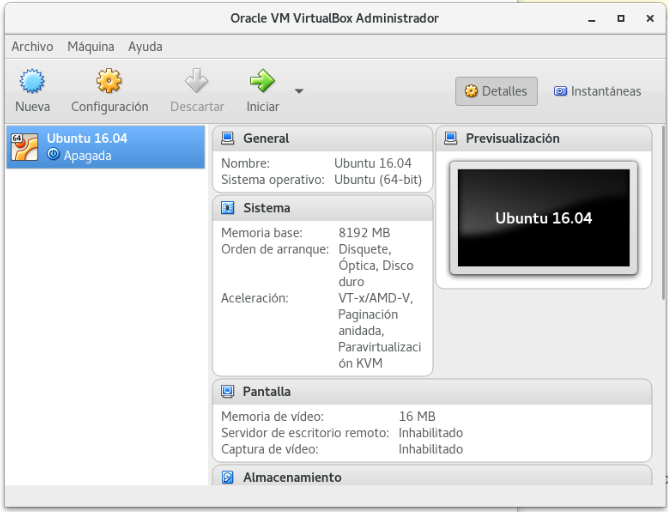
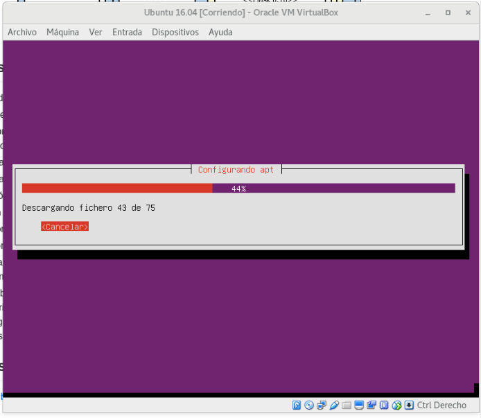
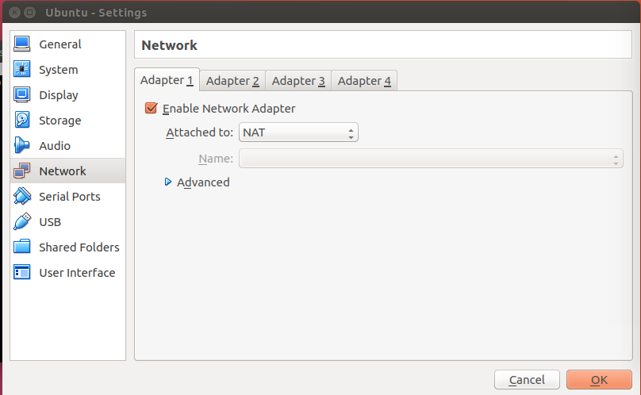
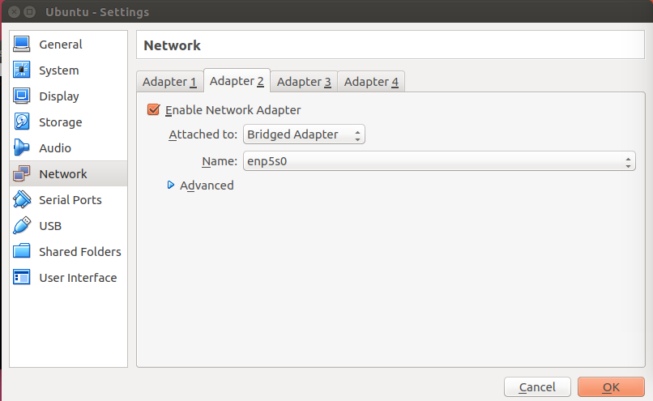
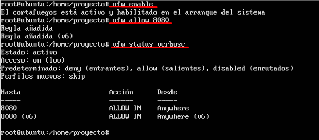

## Miniproyecto Sistemas Operativos

**Universidad ICESI**  

**Nombres:**
  * Esteban Camacho B. - A00320168  
  * Oscar Daniel Molano. - A00267576 
  * Jhon Eduar Tobar G. - A00316212
  
**Github URL:** https://github.com/LookIron/so-project

**Curso:** Sistemas Operativos  
**Docente:** Daniel Barragán C.  
**Tema:**  Servicios web  
**Correo:** daniel.barragan at correo.icesi.edu.co

## Objetivos
* Desplegar una aplicación en un servidor que ejecuta el sistema operativo Linux
* Realizar los ajustes y depuración necesarios para desplegar una
aplicación en Linux
* Realizar aplicaciones para obtener información del sistema operativo

## Descripción
Para el despliegue de una aplicación en un servidor se requiere conocer los procedimientos necesarios relacionados con la configuracion de las interfaces de red, ajustes de seguridad, instalación de dependencias, usuarios y herramientas de depuracíon del sistema operativo.

El siguiente proyecto consiste en el despliegue de una aplicación web para obtener información del sistema operativo (La aplicación debe permitir consulta uso de CPU, memoria y espacio en disco). Para este propósito se debe emplear el sistema operativo Ubuntu Server 16.04, el microframework flask y ambientes virtuales.

<p align="center">
  
</p>

## Actividades
* Nombre y código de todos los integrantes del grupo (máximo 3) (5%)
* Ortografía y redacción (5%)
* Descripción breve de los pasos para cumplir con lo solicitado
  * Sistema operativo Ubuntu Server 16.04 (10%)
  * Configuración de interfaces de red (10%)
  * Configuración de puertos (10%)
  * Instalación de dependencias (10%)
  * Creación de ambientes virtuales (10%)
  * Aplicación en Python (10%)
  * Validación de la ejecución del servicio (netstat) (10%)
* Pruebas de la solución a través de capturas de pantalla. Puede emplear si lo desea una herramienta de captura de pantalla a formato .gif (10%)
* El informe debe ser entregado en formato pdf a través del moodle y el informe en formato README.md debe ser subido a un repositorio de github. El repositorio de github debe ser un fork de https://github.com/ICESI-Training/so-project y para la entrega deberá hacer un Pull Request (PR) respetando la estructura definida. El código fuente y la url de github deben incluirse en el informe (10%).

-------------

## Solución

Para la realización del proyecto seguimos los siguientes pasos:

#### *1. Intalación de Ubuntu 16.04:* Se descargó la ISO de `Ubuntu Server` y se realizó la instalacción utilizando VirtualBox como se muestra a continuación:

  * Configuración de la maquina virtual
  
     <p align="center">
     
     </p>
     
  * Instalacción de `Ubuntu Server 16.04`
  
     <p align="center">
     
     </p>
    
  * Posterior a esto se creó un usuario proyecto para la realización de los demás pasos.
  
     ```vim
     # adduser proyecto
     # pwdpass ********
     
     ```
  * 
  

#### *2. Configuración de la interfaces de red:* Ésta se realizó a través de la interfaz de VirtualBox en dos modos uno `NAT` que nos permite traducir las IPs privadas de la red en una IP pública para que la red pueda enviar paquetes al exterior; y traducir luego esa IP pública, de nuevo a la IP privada del pc que envió el paquete, para que pueda recibirlo una vez que llega la respuesta. Y un modo `Adaptador puente (Bridge)` el cual nos permite conectar dos segmentos de red iguales o distintos para que así a traves de otro nodo se pueda acceder al servicio de wed del nodo en el que se pondra el servicio web a través de flask. A continuación mostramos como se realizó dicho proceso.

  * Configuración de la red
  
     <p align="center">
     
     </p>
    
  * Verificación del archivo interfaces: Debido a que nuestra red cuenta con `dhcp` la ip se genera dinamicamente por la tanto vamos a fijar nuestra interfaces para que sea estatica y quede permanente en el archivo de configuración.
  
     <p align="center">
     
     </p>
      

#### *3. Configuración de puertos:* Una vez configurada la interfaces de red, proseguimos a congigurar los puertos, para esto se realizaron los siguientes pasos:

  * Se habilito el firewall a través de la herramienta `ufw` con el siguiente comando
  
     ```vim
     # ufw enable

     ```
     
  * Se habilito el puerto 8080 para los servicios que se van a prestar, con el siguiente comando
  
     ```vim
     # ufw allow 8080

     ```
  
  * Por último verificamos que efectivamente estan habilitado, con el siguiente comando.
  
     ```vim
     # ufw status verbose

     ```
  * Prueba de funcionamiento
  
     <p align="center">
     
     </p>
  

#### *4. Instalación de las dependencias:* Para esto realizamos los siguientes pasos:

  * Debemos de verificar la versión de python la cual en `Ubuntu Server 16.04` viene por defecto la 3, y para nuestras pruebas vamos a utilizar la versión 2.7. Ahora instalamos las dependencias necesarias para `Python`.
  
     ```vim
     # apt-get install build-essential checkinstall
     # apt-get install libreadline-gplv2-dev libncursesw5-dev libssl-dev libsqlite3-dev tk-dev libgdbm-dev libc6-dev libbz2-dev
     # wget https://www.python.org/ftp/python/2.7.13/Python-2.7.13.tgz
     # tar xzf Python-2.7.13.tgz
     

     ```
  
  * Se instaló Flask
  
     ```vim
     # ufw status verbose

     ```
  
  * Se instaló virtulenv
  
      ```vim
     # ufw status verbose

     ```
  
  * Se instaló virtualwrapper
  
     ```vim
     # ufw status verbose

     ```
  
  * Verificación de las dependencias instaladas
  
     <p align="center">
     
     </p>

5.

  * 
  
  *
  
  *
  
  


 
## Referencias
* https://www.ubuntu.com/download/server

