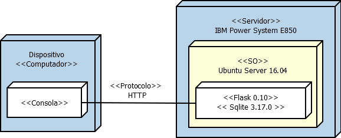

## Miniproyecto Sistemas Operativos

**Universidad ICESI**  

**Nombres:**
  * Esteban Camacho B. - A00320168  
  * Oscar Daniel Molano. - A00267576 
  * Jhon Eduar Tobar G. - A00316212
  
**Github URL:** https://github.com/LookIron/so-project

**Curso:** Sistemas Operativos  
**Docente:** Daniel Barragán C.  
**Tema:**  Servicios web  
**Correo:** daniel.barragan at correo.icesi.edu.co

## Objetivos
* Desplegar una aplicación en un servidor que ejecuta el sistema operativo Linux
* Realizar los ajustes y depuración necesarios para desplegar una
aplicación en Linux
* Realizar aplicaciones para obtener información del sistema operativo

## Descripción
Para el despliegue de una aplicación en un servidor se requiere conocer los procedimientos necesarios relacionados con la configuracion de las interfaces de red, ajustes de seguridad, instalación de dependencias, usuarios y herramientas de depuracíon del sistema operativo.

El siguiente proyecto consiste en el despliegue de una aplicación web para obtener información del sistema operativo (La aplicación debe permitir consulta uso de CPU, memoria y espacio en disco). Para este propósito se debe emplear el sistema operativo Ubuntu Server 16.04, el microframework flask y ambientes virtuales.

<p align="center">
  
</p>

## Actividades
* Nombre y código de todos los integrantes del grupo (máximo 3) (5%)
* Ortografía y redacción (5%)
* Descripción breve de los pasos para cumplir con lo solicitado
  * Sistema operativo Ubuntu Server 16.04 (10%)
  * Configuración de interfaces de red (10%)
  * Configuración de puertos (10%)
  * Instalación de dependencias (10%)
  * Creación de ambientes virtuales (10%)
  * Aplicación en Python (10%)
  * Validación de la ejecución del servicio (netstat) (10%)
* Pruebas de la solución a través de capturas de pantalla. Puede emplear si lo desea una herramienta de captura de pantalla a formato .gif (10%)
* El informe debe ser entregado en formato pdf a través del moodle y el informe en formato README.md debe ser subido a un repositorio de github. El repositorio de github debe ser un fork de https://github.com/ICESI-Training/so-project y para la entrega deberá hacer un Pull Request (PR) respetando la estructura definida. El código fuente y la url de github deben incluirse en el informe (10%).

-------------

## Solución

Para la realización del proyecto seguimos los siguientes pasos:

#### *1. Intalación de Ubuntu 16.04:* Se descargó la ISO de `Ubuntu Server` y se realizó la instalacción utilizando VirtualBox como se muestra a continuación:

  * Configuración de la maquina virtual
  
     <p align="center">
     
     </p>
     
  * Instalacción de `Ubuntu Server 16.04`
  
     <p align="center">
     
     </p>
     
     <p align="center">
     
     </p>
    
  * Posterior a esto se creó un usuario proyecto para la realización de los demás pasos.
  
     ```vim
     # adduser proyecto
     # pwdpass ********
     
     ```
  * 
  

#### *2. Configuración de la interfaces de red:* Ésta se realizó a través de la interfaz de VirtualBox en dos modos uno `NAT` que nos permite traducir las IPs privadas de la red en una IP pública para que la red pueda enviar paquetes al exterior; y traducir luego esa IP pública, de nuevo a la IP privada del pc que envió el paquete, para que pueda recibirlo una vez que llega la respuesta. Y un modo `Adaptador puente (Bridge)` el cual nos permite conectar dos segmentos de red iguales o distintos para que así a traves de otro nodo se pueda acceder al servicio de wed del nodo en el que se pondra el servicio web a través de flask. A continuación mostramos como se realizó dicho proceso.

  * Configuración de la red
  
     <p align="center">
     
     </p>
     
     <p align="center">
     
     </p>
    
  * Verificación del archivo interfaces: Debido a que nuestra red cuenta con `dhcp` la ip se genera dinamicamente por la tanto vamos a fijar nuestra interfaces para que sea estatica y quede permanente en el archivo de configuración.
  
     <p align="center">
     
     </p>
      

#### *3. Configuración de puertos:* Una vez configurada la interfaces de red, proseguimos a congigurar los puertos, para esto se realizaron los siguientes pasos:

  * Se habilito el firewall a través de la herramienta `ufw` con el siguiente comando
  
     ```vim
     # ufw enable

     ```
     
  * Se habilito el puerto 8080 para los servicios que se van a prestar, con el siguiente comando
  
     ```vim
     # ufw allow 8080

     ```
  
  * Por último verificamos que efectivamente estan habilitado, con el siguiente comando.
  
     ```vim
     # ufw status verbose

     ```
  * Prueba de funcionamiento
  
     <p align="center">
     
     </p>
  

#### *4. Instalación de las dependencias:* Debemos realizar esto para la configuración del ambiente virtual. Para esto realizamos los siguientes pasos:

  * Debemos de verificar la versión de python la cual en `Ubuntu Server 16.04` viene por defecto la 3, y para nuestras pruebas vamos a utilizar la versión 2.7. Ahora instalamos las dependencias necesarias para `Python`.
  
     ```vim
     # apt-get install build-essential checkinstall
     # apt-get install libreadline-gplv2-dev libncursesw5-dev libssl-dev libsqlite3-dev tk-dev libgdbm-dev libc6-dev libbz2-dev
     # wget https://www.python.org/ftp/python/2.7.13/Python-2.7.13.tgz
     # tar xzf Python-2.7.13.tgz
     

     ```
  Una vez descargado y descomprimido este archivo proseguimos a la compilación e instalación
  
     ```vim
     # cd Python-2.7.13
     # sudo ./configure
     # sudo make install
    
     ```
  
  * despues de configurar e instalar python debemos instalar y configurar en ambiente virtual
  
     ```vim
     # sudo wget https://bootstrap.pypa.io/get-pip.py
     # python get-pip.py
     # pip install virtualenv
     
     # cd ~/
     # mkdir envs
     # cd envs
     # virtualenv flask_env

     ```
  
  * Se instaló virtulenv
  
      ```vim
     # ufw status verbose

     ```
  
  * Se instaló virtualwrapper
  
     ```vim
     # ufw status verbose

     ```
  
  * Verificación de las dependencias instaladas
  
     <p align="center">
     
     </p>

5.

  * 
  
  *
  
  *
  Proyecto Final - Sistemas Operacionales
  https://youtu.be/tuykFwNYWfQ
  
------------------------  

from flask import Flask
import os
app = Flask(__name__)

@app.route("/memoria")
def memory():
        m=os.system("echo | free > /home/proyecto/memory_Info.txt")
        f=open("/home/proyecto/memory_Info.txt","r")
        return f.read()

@app.route("/cpu")
def cpu():
        m=os.system("echo | lscpu > /home/proyecto/cpu_Info.txt")
        f=open("/home/proyecto/cpu_Info.txt","r")
        return f.read()

@app.route("/disco")
def disk():
        m=os.system("echo | df > /home/proyecto/disco_Info.txt")
        f=open("/home/proyecto/disco_Info.txt","r")
        return f.read()

@app.route("/netstat")
def netstat():
        m=os.system("echo | netstat > /home/proyecto/netstat_Info.txt")
        f=open("/home/proyecto/netstat_Info.txt","r")
        return f.read()

if __name__=="__main__":
        app.run('0.0.0.0',port=8080)
----------------------------


ip addr add 192.168.130.100/24 dev enp0s3
    3  ping 8.8.8.8
    4  clear
    5  sudo apt-get install python3-pip
    6  clear
    7  sudo pip3 install virtualenv
    8  clear
    9  ip a
   10  ip addr add 192.168.130.170/24 dev enp0s3
   11  sudo ip addr add 192.168.130.170/24 dev enp0s3
   12  sudo nmcli con up enp0s8
   13  sudo nmcli con up enp0s3
   14  ip a
   15  ping 8.8.8.8
   16  clear
   17  virtualenv proyecto
   18  source proyecto/bin/activate
   19  pip install flask
   20  vi script.py
   21  exit
   22  ip a
   23  ls /etc/network/
   24  nano /etc/network/interfaces
   25  ls /etc/network/
   26  nano /etc/network/interfaces
   27  ip a
   28  sudo nano /etc/network/interfaces
   29  sudo service networking restart
   30  service networking status
   31  ip addr add 192.168.130.170/24 dev enp0s8
   32  sudo ip addr add 192.168.130.170/24 dev enp0s8
   33  ip a
   34  ping 192.168.130.1 -S
   35  ping 192.168.130.1 -I enp0s8
   36  ping 192.168.113.1 -I enp0s8
   37  ping 192.168.130.1 -I enp0s8
   38  ping 192.168.113.1 -I enp0s8
   39  ping 8.8.8.8 -I enp0s8
   40  nmcli
   41  sudo route add default gw 192.168.130.1
   42  ping 8.8.8.8 -I enp0s8
   43  ping 192.168.113.1 -I enp0s8
   44  sudo service networking restart
   45  sudo service networking restart -v
   46  sudo service networking restart
   47  ping 192.168.113.1 -I enp0s8
   48  ping 192.168.113.1 -v
   49  ip a
   50  ping 192.168.104.1
   51  ping 8.8.8.8
   52  apt-get install openssh-server
   53  sudo apt-get install openssh-server
   54  ufw
   55  ufw ?
   56  ufw status verbose
   57  sudo ufw status verbose
   58  cat /etc/network/interfaces
-----------------------------------------------------

# This file describes the network interfaces available on your system
# and how to activate them. For more information, see interfaces(5).

source /etc/network/interfaces.d/*

# The loopback network interface
auto lo
iface lo inet loopback

# The primary network interface
auto enp0s3
iface enp0s3 inet dhcp

# The secondary network interface
auto enp0s8
iface enp0s8 inet manual
-------------------------------------------

 
## Referencias
* https://www.ubuntu.com/download/server

