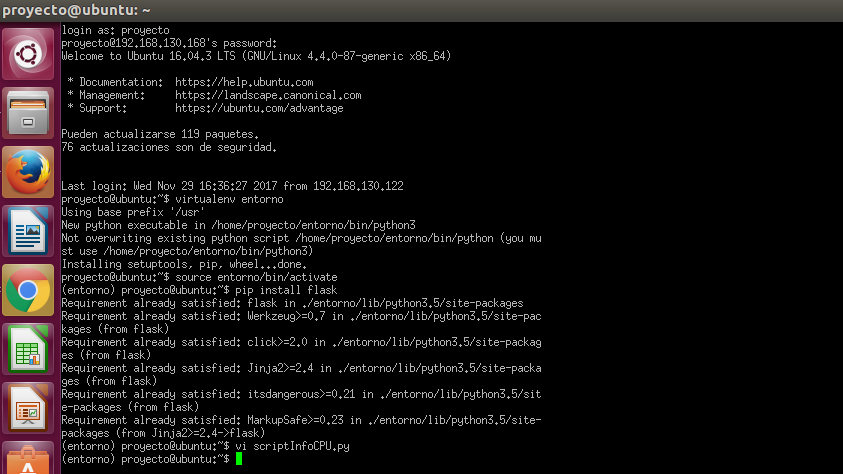
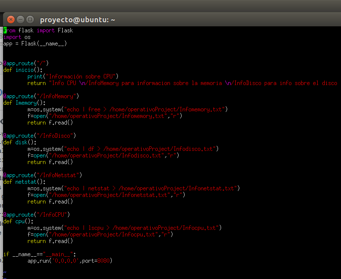
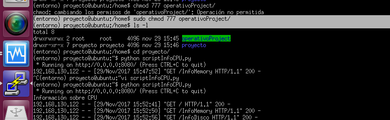

## proyecto Sistemas Operativos

**Universidad ICESI**  

**Nombres:**
  * Esteban Aguirre - A00320188  
  * Daniel Ocampo - A00053980 
  * Sergio Ospina - A00057008
  
  *Github URL:** https://github.com/esteban9212/so-project

**Curso:** Sistemas Operativos  
**Docente:** Daniel Barragán C.  
**Tema:**  Servicios web  
**Correo:** daniel.barragan at correo.icesi.edu.co

## Objetivos
* Desplegar una aplicación en un servidor que ejecuta el sistema operativo Linux
* Realizar los ajustes y depuración necesarios para desplegar una
aplicación en Linux
* Realizar aplicaciones para obtener información del sistema operativo

## Descripción
Para el despliegue de una aplicación en un servidor se requiere conocer los procedimientos necesarios relacionados con la configuracion de las interfaces de red, ajustes de seguridad, instalación de dependencias, usuarios y herramientas de depuracíon del sistema operativo.

El siguiente proyecto consiste en el despliegue de una aplicación web para obtener información del sistema operativo (La aplicación debe permitir consulta uso de CPU, memoria y espacio en disco). Para este propósito se debe emplear el sistema operativo Ubuntu Server 16.04, el microframework flask y ambientes virtuales.

<p align="center">
  
</p>

## Actividades
* Nombre y código de todos los integrantes del grupo (máximo 3) (5%)
* Ortografía y redacción (5%)
* Descripción breve de los pasos para cumplir con lo solicitado
  * Sistema operativo Ubuntu Server 16.04 (10%)
  * Configuración de interfaces de red (10%)
  * Configuración de puertos (10%)
  * Instalación de dependencias (10%)
  * Creación de ambientes virtuales (10%)
  * Aplicación en Python (10%)
  * Validación de la ejecución del servicio (netstat) (10%)
* Pruebas de la solución a través de capturas de pantalla. Puede emplear si lo desea una herramienta de captura de pantalla a formato .gif (10%)
* El informe debe ser entregado en formato pdf a través del moodle y el informe en formato README.md debe ser subido a un repositorio de github. El repositorio de github debe ser un fork de https://github.com/ICESI-Training/so-project y para la entrega deberá hacer un Pull Request (PR) respetando la estructura definida. El código fuente y la url de github deben incluirse en el informe (10%).

----------------

## Desarrollo

## * Instalación Sistema operativo Ubuntu Server 16.04  n 

imagenes instalacion  


## * Configuración de interfaces de red  
imagenes adapter y nat

Este taller se desarrolló dentro de la red del laboratorio de redes, que nos generaba una ip dinamica, tuvimos que configurar el archivo interfaces para habilitar la ip de las interfaces de forma manual, como muestra en la imagen.  

 


Asignamos la ip 192.168.130.168/24 y el gateway, a continuación se muestra este proceso por medio de los comandos ip addr, route  

 ```vim
ip addr add 192.168.130.168/24 dev enp0s8
route add default gw 192.168.130.1
service networking restart 
   ```


## * Configuración de puertos 

EL siguiente paso es el de habilitar el firewall y el puerto 8080, a traves de los comandos ufw enable y ufw allow 8080, a continuación se muestra la imagen de la configuración  

 
  

## * Instalación de dependencias  

Se instalaron las siguientes dependencias


 ```vim
sudo apt-get install python3-pip
sudo pip3 install virtualenv
   ```  


## * Creación de ambientes virtuales  
Proseguimos con la creacion de ambiente en donde trabajaremos, esto mediante el siguiente comando  

```vim
virtualenv entorno
```  
 Y para la activacion del ambiente el siguiente comando  
 
```vim
source entorno/bin/activate
```  
y finalmente la instalación de flask dentro del entorno ya creado  
```vim
pip install flask
```  

 
   
## * Aplicación en Python   

El proyecto tiene como requerimiento el despliegue de una aplicación web para obtener información del sistema operativo, para lograr esto construimos el siguiente script en python dentro del ambiente virtual, que se encarga de hacer llamados al sistema operativo, guardarlos y luego retornarlos, a continuacion la estructura del script.  


 


## * Validación de la ejecución del servicio (netstat)   
ejecutamos el siguiente comando dentro de nuestro ambiente para validar que nuestro script funciona correctamente, pero para este debemos darle permisos a la carpeta donde estamos guardando los reportes.


   

Ahora si ejecutamos nuestro script  
```vim
python scriptInfoCPU.py
``` 
A continuación un video del funcionamiento configurado  
   
     * Ya creado el script lo ejecutamos dentro del ambiente virtual, a continuación se muestra como se activa y se ejecuta el script con los servicios y como desde otro nodo se acceden a los servicios desde el navegador. Da click sobre la imagen para ver video del funcionamiento.
  
  *  [ir a video](https://www.youtube.com/watch?v=qAihzvqKkF4&feature=youtu.be)


